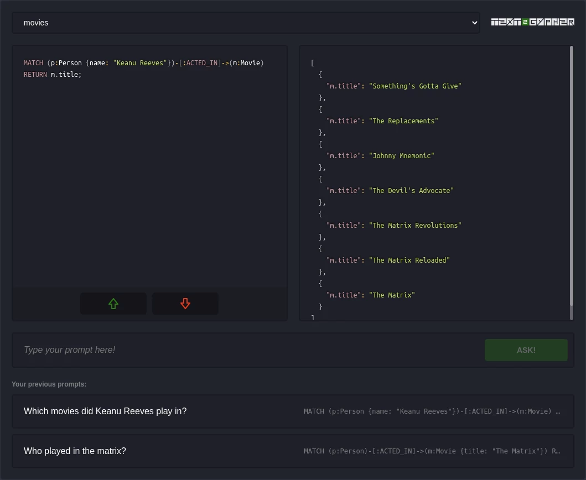

# text2cypher

Try out how well [text-to-cypher](https://python.langchain.com/docs/use_cases/graph/graph_cypher_qa) approach works on your own Neo4j databases.



Bind a feedback database to collect generated cypher feedback.

## Run with Docker

Setup env:

`cp .env.template .env` 

`OPENAI_API_KEY` and `DATABASES` env vars are required. `DATABASES` accepts a string containing an array of database connection objects. You can provide multiple databases (see `.env.example`).

Example database connection object:

```
{
    "uri":"neo4j+s://demo.neo4jlabs.com",
    "name":"test_db",
    "username":"test",
    "password":"test"
}
```

Docker compose will read env variables from your `.env` file.

`docker compose up --build`

Docker container will spin up on [127.0.0.1:3001](http://127.0.0.1:3001)`.

## .env vars

Check `.env.example` for overview on how to setup `.env` vars.

| Parameter                | Description                                                                                                                                                                                                |
| ------------------------ | -----------------------------------------------------------------------------------------------------------------------------------------------------------------------------------------------------------|
| `OPENAI_API_KEY`         | Your [OpenAI API key](https://platform.openai.com/api-keys)                                                                                                                                                |
| `DATABASES`              | String containing an array of your database connection objects. Example:<br /> `'[{"uri":"neo4j+s://demo.neo4jlabs.com","name":"test_db","username":"test","password":"test"}]'`                           |
| `FEEDBACK_DATABASE`      | [optional] String containing your feedback database connection object. Example:<br /> `'{"uri":"neo4j+s://example.databases.neo4j.io","name":"feedback_db","username":"feedback","password":"feedback"}'`  |
| `PROMPT_MAX_LENGTH`      | [optional] Maximum allowed prompt length. Default: `300`                                                                                                                                                   |
| `PROMPT_MAX_DURATION_MS` | [optional] Maximum duration of prompt request. Default: `10000`                                                                                                                                            |
| `HOST`                   | [optional] Server host. Default: `127.0.0.1`                                                                                                                                                               |
| `PORT`                   | [optional] Server port for app to run on. Default: `3001`  

## Build and run with NodeJS

Setup env:

`cp .env.template .env` and add missing keys.

Install dependencies:

`npm install`

Build:

`npm run build`

Run:

`cd dist && npm start`

## Development

Setup env:

`cp .env.template .env`

and add missing keys. Check `.env.example` for setup. Multiple input `DATABASES` are supported.

Install dependencies:

`npm install`

Run local development server:

`npm run dev`

This project is built with [Fastify](https://www.fastify.io/docs/latest/), [Langchain](https://js.langchain.com/docs/get_started/introduction) and [HTMX](https://htmx.org/).
